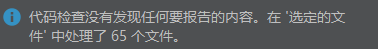

# Posture Body Recognition AI algorithm developer system 🙋‍♂️


## Introduction

Developer of Posture Body Recognition AI algorithm management system

## environment

| Library/Framework | Version |
|-------------------|---------|
| MySQL             | 8.0.33  |
| JDK               | 8       |
| Vue.js            | 2.x     |
| MyBatis Plus      | 3.5.3   |
| Spring Boot       | 2.7.13  |
| Apache POI        | 5.0.0   |
| Lombok            | 1.18    |

## Quick start

```shell
tar -zxvf algorithm-management-xxx.tar.gz
cd algorithm-management-xxx
sh bin/start.sh
```

## code review

Alibaba Java Coding Guidelines

